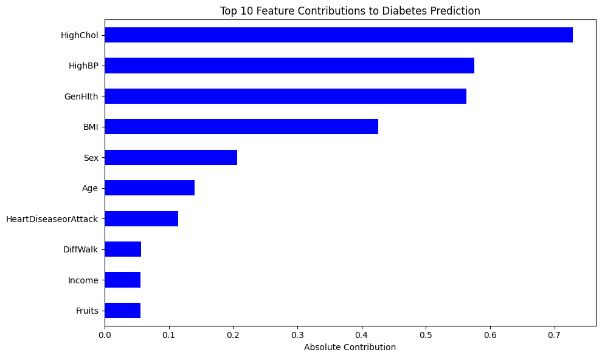
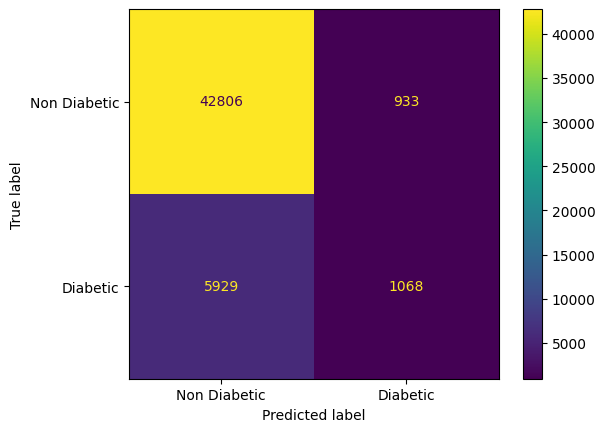
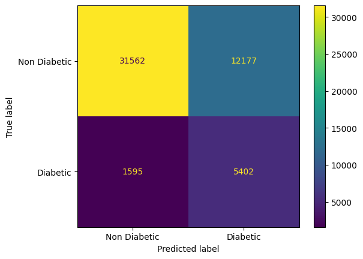

# Diabetes Prediction Using Machine Learning  
A complete machine learning pipeline analyzing the factors most associated with diabetes and predicting diabetes outcomes using classification models.

---

## Key Insights & Findings  

### **Strongest Predictors**
Analysis shows the following variables contributed most to predicting diabetes:

- **Glucose Levels** – strongest single predictor  
- **BMI** – positively correlated with diabetes outcome  
- **Age** – older individuals showed higher likelihood  
- **Insulin & SkinThickness** – low predictive contribution



### **Model Performance**
Two confusion matrices (from different models or thresholds) show:

- Model 1: More conservative, fewer false positives  
- Model 2: Slightly more balanced recall/precision tradeoff  

**Confusion Matrix (Model 1)**  


**Confusion Matrix (Model 2)**  


### **Overall Conclusion**
- Glucose alone explains a large portion of variance  
- Multivariate models outperform single-metric heuristics  
- Good baseline performance, but further tuning and feature engineering could improve scores  
- Dataset has limitations (missing values, imputation, imbalanced classes)

---

## Project Summary  
The goal of this project is to build a complete machine learning workflow to predict whether an individual has diabetes based on diagnostic measurements from the Pima Indians Diabetes Dataset.

This project demonstrates:

- Data cleaning & preprocessing  
- Exploratory Data Analysis  
- Principal component analysis  
- Logistic regression modeling  
- Confusion matrix evaluation  
- Interpretability via feature contributions  

---

## Problem Statement  
Diabetes is a growing global health issue. Early detection can reduce long-term complications.  
This project builds and evaluates classification models to identify patterns among patients and predict diabetes using clinical measurements.

---

## Dataset Overview  
The dataset includes the following features:

- Pregnancies  
- Glucose  
- Blood Pressure  
- SkinThickness  
- Insulin  
- BMI  
- DiabetesPedigreeFunction  
- Age  
- Outcome (target variable)

Common data issues addressed:

- Zero values in features where zero is not physiologically meaningful  
- Missing data handled through imputation  
- Standardization for PCA and model stability  

---

## Exploratory Data Analysis (EDA)  
Key steps:

- Distribution analysis of glucose, BMI, and age  
- Scatterplots showing relationships with Outcome  
- Correlation analysis among features  
- Identification of outliers and zero-inflated columns  
- Visualizations highlighting feature differences between diabetic and non-diabetic groups

---

## Data Cleaning & Preprocessing  

- Replaced zero values in physiological features with median values  
- Standardized numeric columns  
- Created training/testing splits  
- Performed Principal Component Analysis for dimensionality understanding  
- Scaled data for logistic regression modeling  

---

## Modeling Approach  

### **1. Logistic Regression**
- Used as primary classification model  
- Coefficients analyzed for interpretability  
- PCA-informed modeling to reduce multicollinearity  

### **2. Evaluation Metrics**
- Confusion Matrices  
- Accuracy  
- Recall  
- Precision  
- ROC/AUC available for extension  

---

## Model Evaluation  

### **Confusion Matrix (Model 1)**  


- Sensitivity: 0.15263684436186936
- Specificity: 0.9786689224719358
- Accuracy: 0.8647508672343109

### **Confusion Matrix (Model 2)**  


- Sensitivity: 0.7720451622123767
- Specificity: 0.7215985733555865
- Accuracy: 0.728555660674866

### Understanding the Metrics

**Sensitivity (Recall / True Positive Rate)**  
Measures how well the model identifies actual diabetes cases.  
High sensitivity = fewer missed diabetics.

\[
\text{Sensitivity} = \frac{TP}{TP + FN}
\]

---

**Specificity (True Negative Rate)**  
Measures how well the model correctly identifies non-diabetics.  
High specificity = fewer false alarms.

\[
\text{Specificity} = \frac{TN}{TN + FP}
\]

---

**Accuracy**  
Overall percentage of correct predictions (both diabetics and non-diabetics).

\[
\text{Accuracy} = \frac{TP + TN}{TP + TN + FP + FN}
\]

---

### Why These Metrics Matter in Healthcare

- **High sensitivity** is important when missing a diabetes case is dangerous.  
- **High specificity** is important when false positives cause unnecessary stress or testing.  
- **Accuracy alone is not enough**, especially if the dataset is imbalanced, 
  sensitivity and specificity give a much clearer picture of medical relevance.

### **Feature Contribution Plot**


---

## Conclusions  
- Glucose is the most dominant predictor  
- BMI and Age meaningfully improve classification  
- Logistic Regression provides a strong interpretable baseline  
- The dataset can support more advanced models (Random Forest, XGBoost) for improved accuracy  
- Preprocessing significantly impacts performance due to missing/zero values  

---

## How to Run Locally  

### Clone the repo:
```bash
git clone https://github.com/GaryJS/Diabetes_Machine_Learning.git
```

### Install dependencies:
This project runs entirely from the Jupyter Notebook.

Ensure the following Python libraries are installed:

```bash
pip install numpy pandas matplotlib seaborn scikit-learn
```

### Run the notebook:
Open in Jupyter Notebook or VS Code:

```bash
jupyter notebook Diabetes_data.ipynb
```

---

## Tech Stack  

- **Python**
- **Jupyter Notebook**
- **NumPy / Pandas**
- **Matplotlib / Seaborn**
- **Scikit-Learn**

---

## License  
This project is open for educational and portfolio use.  
Attribution appreciated.

